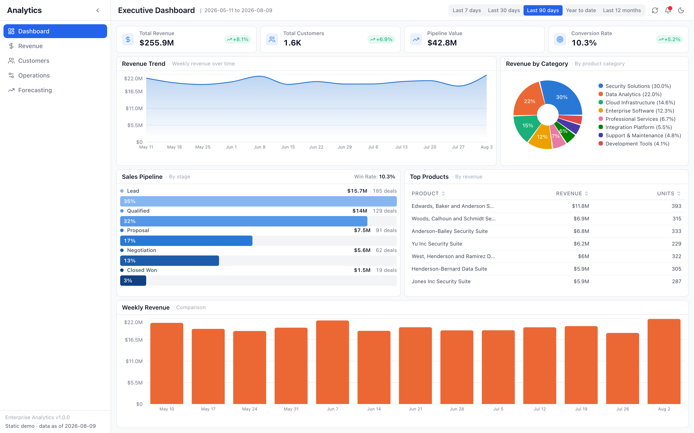
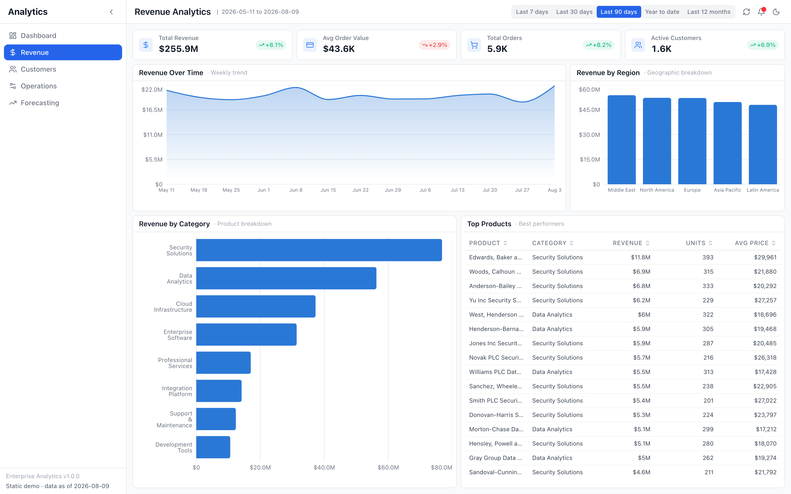
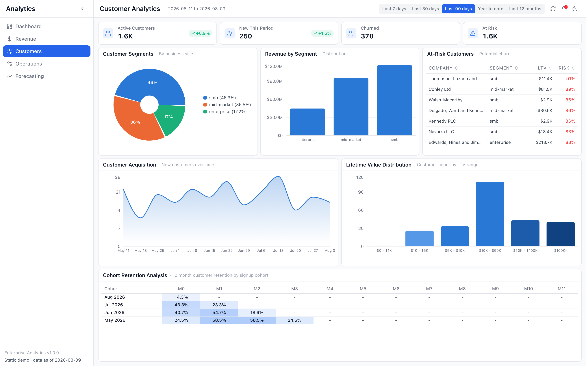
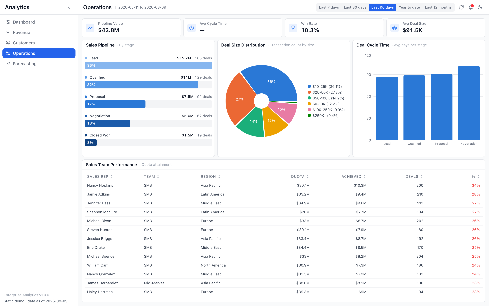
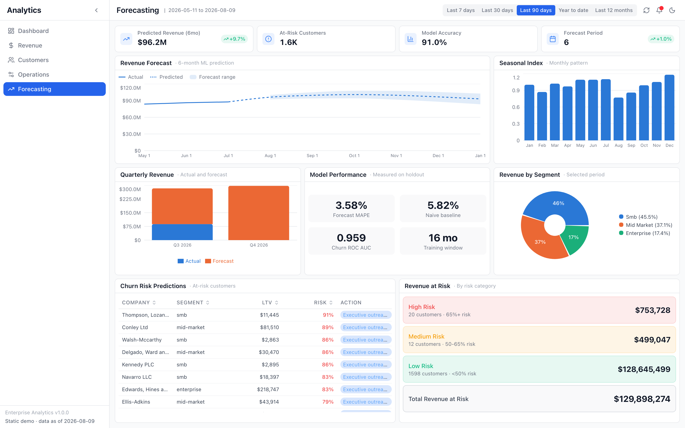

# Analytics Dashboard

A business intelligence platform with five pages of reporting over one warehouse. Revenue, customers, pipeline, and forecasting. Built with React 19, Flask, and PostgreSQL.

### **[Open the live demo](https://analytics.ryansansbury.com)**

No signup. Everything on screen came out of the code in this repository. The queries ran against PostgreSQL and the churn and forecasting numbers come from scikit-learn models scored on a holdout.

[](https://github.com/ryansansbury/analytics_dashboard/actions/workflows/ci.yml)


## The five pages

**Dashboard.** The executive view. KPIs against the prior period of equal length, a revenue trend that rebuckets with the filter, the pipeline funnel, and top products.



**Revenue.** Breakdowns by category, region, and channel over a filterable window.



**Customers.** Segmentation, cohort retention by month offset, lifetime value distribution, and the accounts the churn model flags.



**Operations.** The sales funnel end to end. Quota attainment per rep, cycle time per stage, and deal size distribution.



**Forecasting.** Six months ahead with a confidence band from holdout error. Model metrics sit next to the baseline they have to beat.



## The models

Two of them. Both measured on data the model never trained on.

| Model | Task | Validation | Result |
|---|---|---|---|
| `GradientBoostingClassifier` | Churn risk per customer | Stratified holdout | **0.959 ROC AUC** |
| `Ridge` on engineered time features | Monthly revenue forecast | Chronological holdout | **3.58% MAPE** against a 5.82% naive baseline |

The forecast is validated chronologically and never on a shuffled split. Shuffling lets a time-series model train on the future to predict the past. That produces excellent validation numbers and a useless model.

MAPE on its own says nothing about whether a model is worth running. Against a last-value baseline it does. This one beats the baseline by a real but unremarkable margin and the API reports both figures.

Churn features are RFM plus tenure and account attributes. The latent variable driving the label gets stripped before the frame reaches the model. Nothing can read the answer back out. `/api/forecasting/model-performance` returns the exact numbers above and `backend/tests/test_forecasting_api.py` asserts the endpoint matches the trained model rather than deriving anything.

## Two rules this codebase holds to

**Numbers are measured and never generated.** This application used to report model accuracy and churn scores from `random.uniform()`. All of it comes from trained models now. Where a figure cannot be derived the API returns `null` and the page renders a blank. A null change field means there is no prior period to compare against. It does not mean the change was zero.

**A partly covered time bucket is not plotted.** Nine days of a month sitting beside twelve finished ones reads as a collapse rather than as a month that is not over. The rule lives in `backend/app/periods.py` and every time-series endpoint calls it. It exists because the same data once trended up under a 90-day filter and fell off a cliff under Year to Date with bucket size the only difference.

## The hosted demo is a static build

The application runs against live PostgreSQL. That is the real mode and every instruction below describes it.

The demo is a build artifact of that same application. No server and no database. `backend/scripts/snapshot.py` boots the real Flask app, trains the models, walks every endpoint the interface calls under all five date presets, and freezes the responses to `frontend/public/data/`. The React build reads those files. One flag switches it.

```bash
npm run build          # live, talks to Flask and Postgres
npm run build:static   # static, reads the snapshot
```

Regenerate and publish in one step.

```bash
./scripts/refresh-demo.sh              # reseed, snapshot, test, build, deploy
./scripts/refresh-demo.sh --no-deploy  # everything except publishing
```

The coverage test runs before the deploy and not after. A snapshot missing an endpoint stops the release instead of reaching production as a blank chart. The script pins its own database rather than reading an ambient `DATABASE_URL`. Inheriting one points a reseed at whatever project exported it.

Two things worth stating plainly.

Every number in the demo came out of the real pipeline. The queries ran and the models were fit. Nothing is hand-written and the snapshot is a build artifact rather than a fixture maintained by hand.

The demo's clock is frozen at the date the snapshot was taken and the sidebar says so. Presets resolve against that date instead of today. Without it they slide forward every morning and ask for a window the snapshot does not hold.

The static path adds one module and one branch in `fetchApi`. Every API function, hook, and component is identical across both modes. The live build tree-shakes the static path out.

## Testing

```bash
cd backend  && pytest -q     # 117 tests
cd frontend && npm test      # 185 tests
```

CI runs both suites plus lint, a type-checked build, and a gitleaks scan on every push. The backend job starts its own PostgreSQL service so the cross-endpoint consistency suite runs there instead of skipping.

The frontend suite includes a coverage check that mounts every page under every preset and serves `fetch` from the snapshot directory. A request the snapshot does not cover fails a test rather than producing a blank chart. It skips itself when no snapshot has been generated.

Destructive fixtures refuse to run against a database whose name does not end in `_test`. Pointing them at a working database destroys the data in it while every test still passes.

## Stack

**Frontend.** React 19 and TypeScript on Vite. TailwindCSS 4, Recharts, TanStack Query, and React Router 7.

**Backend.** Flask 3 and SQLAlchemy over PostgreSQL 15. NumPy, Pandas, and scikit-learn. Gunicorn in production.

**Local.** Docker Compose.

## Getting started

You need Python 3.11+, Node 22+, and PostgreSQL 15+. Postgres is required rather than optional. Most time-series queries use `date_trunc` and SQLite has no equivalent.

### Docker

```bash
git clone https://github.com/ryansansbury/analytics_dashboard.git
cd analytics_dashboard
docker compose up
docker compose exec backend python reseed.py   # once Postgres is accepting connections
```

The application comes up on <http://localhost:5001>.

### Local

```bash
cd backend
python3 -m venv venv && source venv/bin/activate
pip install -r requirements.txt

export DATABASE_URL=postgresql://localhost:5432/analytics_dashboard
createdb analytics_dashboard
python reseed.py        # generates the dataset, a few minutes
python run.py           # http://localhost:5001
```

Port 5001 rather than 5000 because AirPlay Receiver holds 5000 on macOS.

```bash
cd frontend
npm ci
npm run dev             # http://localhost:5173
```

The dev server proxies `/api` to Flask. Both halves share an origin and no CORS setup is needed locally.

Check it came up with `curl -s localhost:5001/api/health`. That endpoint reports row counts and data age. Every other endpoint returns 200 with empty results against an empty database. Correct behaviour and indistinguishable from a broken deployment when you are looking at a blank page.

### Production

```bash
cd frontend && npm run build
cp -r dist/* ../backend/static/
```

Flask then serves the API and the compiled interface from one origin with SPA fallback. `backend/static/` is gitignored. It is build output, and tracking it meant the committed bundle drifted away from the source that produced it.

## API

28 endpoints across five blueprints. Full reference with response shapes in [`docs/API.md`](docs/API.md).

| Prefix | Covers |
|---|---|
| `/api/dashboard` | KPI summary against the prior period |
| `/api/revenue` | Trends plus breakdowns by category, region, and channel |
| `/api/customers` | Segments, cohorts, lifetime value, and at-risk accounts |
| `/api/operations` | Funnel, rep attainment, cycle time, and deal sizes |
| `/api/forecasting` | Revenue forecast, churn risk, seasonality, and model metrics |

Everything is GET and returns JSON. There is no seeding endpoint. Seeding is destructive and lives at the command line.

## Structure

```
analytics_dashboard/
├── backend/
│   ├── app/
│   │   ├── ml/               # features, churn, revenue, lazy-training registry
│   │   ├── models/           # SQLAlchemy models, one per file
│   │   ├── routes/           # five blueprints, one per domain
│   │   ├── periods.py        # the time-bucketing rule
│   │   └── __init__.py       # application factory and /api/health
│   ├── data/seed_data.py     # synthetic data generator
│   ├── scripts/snapshot.py   # freezes the API to JSON for the demo
│   ├── tests/                # 117 tests
│   └── reseed.py
├── frontend/
│   ├── public/data/          # the generated snapshot
│   └── src/
│       ├── components/       # cards, charts, tables, layout, filters
│       ├── hooks/            # one query hook per endpoint, plus filters
│       ├── pages/            # the five pages
│       └── services/         # api client and the static adapter
├── scripts/refresh-demo.sh   # regenerate and publish the demo
└── docs/                     # API, architecture, decisions, setup
```

## Data

Six tables holding products, customers, sales reps, transactions, pipeline, and daily metrics. Roughly 2,000 customers and 45,000 transactions across two years, generated by `backend/data/seed_data.py`.

The generator is deterministic but anchors its window to today minus two years. Rerunning it reproduces the same dataset re-dated rather than a different one.

Churn is driven by behaviour instead of assigned at random. A latent engagement variable drives transaction frequency and the churn hazard together. An earlier version assigned churn at random and no model could learn it. Any accuracy reported against that data had to be invented.

## Environment

| Variable | Default | Purpose |
|---|---|---|
| `DATABASE_URL` | local Postgres | Connection string |
| `FLASK_ENV` | `development` | Selects the config class |
| `SECRET_KEY` | dev placeholder | Set a real value in production |
| `TEST_DATABASE_URL` | `..._test` | Tests only. Must end in `_test` |
| `VITE_API_URL` | `/api` | API base. Unset uses the dev proxy |
| `VITE_STATIC_DATA` | unset | `true` builds the static demo |

## Docs

- [`docs/API.md`](docs/API.md) covers every endpoint with parameters and response shapes.
- [`docs/ARCHITECTURE.md`](docs/ARCHITECTURE.md) covers how the pieces fit.
- [`docs/DECISIONS.md`](docs/DECISIONS.md) records the choices and what each one cost, including the ones later reversed.
- [`docs/SETUP.md`](docs/SETUP.md) goes deeper on installing and running it.

## License

[MIT](LICENSE).
